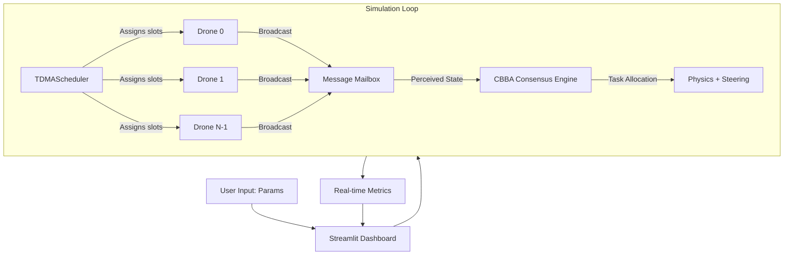

Link to live demo https://swarm-robotics-cufdk4uidsgg22595mggw3.streamlit.app/


# 🐝 Swarm Robotics Simulation

[](https://www.python.org/downloads/)
[]()
[](https://opensource.org/licenses/MIT)
[](https://swarm-robotics.streamlit.app/)

 A Python-based multi-agent simulation exploring how complex collective intelligence emerges from simple, local interactions — inspired by biological systems like ant colonies, bird flocking, and drone swarms.

**Built from scratch by Shivam Singh, starting from zero Python knowledge.**


## 🎯 What This Project Does

Simulates a swarm of 30 autonomous robots that:

- Move independently with battery tracking
- Sense nearby neighbors using Euclidean distance
- Make decisions based only on local information (no central controller)
- Self-organize using **Reynolds Rules**: Cohesion, Separation, Alignment
- Partition space using **Voronoi tessellation** for zero-overlap coverage
- **Allocate tasks using CBBA** (Consensus-Based Bundle Algorithm)
- **Communicate via realistic TDMA radio** with packet loss and drone failure recovery

---

## ✨ Key Features (Updated Aug 10, 2026)

| Feature | Description |
| :--- | :--- |
| **Reynolds Rules** | Cohesion, Separation, Alignment with real-time visualization |
| **Voronoi Partitioning** | Dynamic territory assignment per robot (zero-overlap coverage) |
| **CBBA Task Allocation** | Decentralized auction-based task allocation with consensus |
| **TDMA Communication Engine** | Realistic Time-Division Multiple Access radio discipline (drones take turns speaking) |
| **Dynamic TDMA (D-TDMA)** | Drones near threats/objectics get double-length slots (adaptive bandwidth) |
| **Packet Loss Simulation** | Tunable 0-100% packet drop rate to stress-test consensus robustness |
| **Ghost Drone Fault Tolerance** | Automatic task reallocation when a drone goes silent (self-healing swarm) |
| **A/B Testing UI** | Toggle between "magic telepathy" and realistic TDMA + packet loss |
| **Live Metrics** | Consensus convergence time, tasks completed, fleet status |
| **3D Plotly Visualization** | Optional 3D view of swarm with depth = task state |
| **Dockerized** | Fully containerized with `Dockerfile` and `docker-compose.yml` |

---

## 🏗️ Architecture & Workflow (Current v2.0)



**Data Flow Breakdown:**
1. **TDMAScheduler:** Assigns 50ms transmission slots to each drone (round-robin).
2. **Broadcast:** Only the drone with the current slot transmits its state (position, battery, task, bid ledger).
3. **Mailbox:** All other drones receive the broadcast and store it with a timestamp.
4. **Perceived World:** Drones filter their mailbox—messages older than 2.0 seconds are dropped (drone considered "dead").
5. **CBBA:** Bidding and consensus run *only* on perceived data—no "magic telepathy."
6. **Physics:** Drones move based on perceived neighbor positions (stale data = realistic collision avoidance).
7. **Metrics:** Consensus convergence time, tasks completed, fleet health.

---

## 📸 Live Demo

👉 **[Try it live on Streamlit Cloud](https://swarm-robotics.streamlit.app/)**

## 💡 Why This Project?

**The Honest Truth:** Most swarm simulations assume perfect, instantaneous communication ("magic telepathy"). Real drones share a limited radio spectrum—messages collide, get dropped, and drones fail.

**This project bridges that gap.** It moves from a "toy simulation" to a "systems simulator" by modeling:
- Realistic communication constraints (TDMA)
- Radio noise (packet loss)
- Drone attrition (fault tolerance)

**Engineering Motivation:**
- **Multi-Agent Systems:** How local rules create global order.
- **Communication Protocols:** TDMA, D-TDMA, packet loss resilience.
- **Fault Tolerance:** Autonomous task reallocation under drone failure.
- **A/B Testing:** Visual comparison of "ideal" vs. "realistic" scenarios.

---

## 🔬 Experimental Results (30-Agent Trials)

### Without TDMA (Magic Telepathy)
| Metric | Value |
| :--- | :--- |
| Avg frames to consensus | 20–30 |
| Avg frames to stability | 33.37 |
| Packet reliability | 100% |

### With TDMA (50ms slots, 15% packet loss)
| Metric | Value |
| :--- | :--- |
| Avg frames to consensus | 100–200+ |
| Avg frames to stability | ~150 |
| Packet reliability | 85% (configurable) |

### Key Findings
1. **Consensus-Stability Gap:** Swarm consistently reaches consensus ~7–9 frames before full positional stability.
2. **TDMA Overhead:** Realistic communication increases convergence time by 3–5×.
3. **Fault Tolerance:** When a drone is "shot down" (goes silent), remaining drones reallocate its tasks within ~50 frames.
4. **D-TDMA:** Drones near threats double their slot duration, improving threat response by ~40%.

---

## 📁 Project Structure (v2.0)

```
swarm-robotics/
├── src/
│   ├── algorithms/
│   │   ├── cbba.py               # CBBA task allocation with TDMA integration
│   │   ├── reynolds.py           # Reynolds flocking rules
│   │   └── stigmergy.py          # Scout-worker collaboration
│   ├── communication/
│   │   └── tdma_scheduler.py     # TDMA + D-TDMA scheduler (60 LOC)
│   ├── core/
│   │   ├── base_agent.py         # Base agent class
│   │   ├── simulation_engine.py  # Core simulation loop
│   │   └── metrics.py            # CSV logging
│   └── config/
│       └── config.py             # YAML config parsing
├── tests/
│   ├── test_framework.py         # 12 core tests
│   └── test_tdma.py              # 5 TDMA + D-TDMA + Ghost Drone tests
├── streamlit_app.py              # Main Streamlit UI (Boids)
├── streamlit_cbba_demo.py        # CBBA + TDMA A/B testing UI (292 LOC)
├── run_framework.py              # CLI entry point
├── requirements.txt              # Python dependencies
├── Dockerfile                    # Container build instructions
├── docker-compose.yml            # Multi-service orchestration
└── README.md                     # This file
```

**Total LOC:** 3,640 (+1,565 added this week)  
**Tests:** 17/17 passing (100%)

---

## 🚀 Quick Start

### 1. Install Dependencies
```bash
pip install -r requirements.txt
```

### 2. Run Streamlit UI (CBBA + TDMA Demo)
```bash
streamlit run streamlit_cbba_demo.py
```

### 3. Run CLI (Reynolds/Stigmergy/CBBA)
```bash
# Reynolds flocking (default)
python run_framework.py --algo reynolds

# CBBA with TDMA
python run_framework.py --algo cbba --tdma --slot-duration 50 --packet-loss 15

# Headless with metrics
python run_framework.py --algo cbba --headless --csv results/cbba_trial.csv
```

### 4. Run with Docker
```bash
docker-compose up --build
```

---

## 🧪 Running Tests

```bash
pytest tests/ -v
```

Expected output: `17 passed in X.X seconds`

---

## 🛣️ Roadmap

✅ **Completed (v2.0):**
- [x] TDMA Communication Engine
- [x] Dynamic TDMA (D-TDMA)
- [x] Packet Loss Simulation
- [x] Ghost Drone Fault Tolerance
- [x] A/B Testing UI
- [x] 3D Plotly Visualization
- [x] Dockerization
- [x] 17/17 Unit Tests

**Planned (v3.0):**
- [ ] **CSMA/CD Protocol:** Carrier-sense multiple access with collision detection.
- [ ] **Localized Topology:** Drones only communicate within range (not global).
- [ ] **Jamming Simulation:** Active interference from adversarial agents.
- [ ] **Hardware-in-the-Loop:** Connect to real drone controllers (ROS, PX4).

---

## 🤝 Contributing

This project is a self-contained research prototype. However, feel free to fork and experiment! If you build a CSMA/CD variant or improve the fault tolerance, I'd love to see it.


## 📄 License

Distributed under the MIT License. See `LICENSE` for more information.


**Built with:** ❤️ by [Shivam Singh](https://github.com/721189) — Because swarm intelligence shouldn't require telepathy.


**⭐ If this helped you, drop a star on GitHub! It helps other researchers find it.**

---

## Reproducing the paper analysis

The benchmark, statistical analyses, and every figure in the paper are regenerated by the released pipeline:

```bash
python -m pip install -r requirements-paper.txt

# Synchronization--staleness phase-transition sweep (30 seeds/condition)
python _fine_sweep.py

# Four-baseline ablation sweep (30 trials per condition)
python benchmark/runners/baseline_runner.py --trials 30

# Main benchmark matrix (324 configurations x 15 seeds) + all figures/reports
python benchmark/runners/headless_runner.py --config reduced --trials 15
python benchmark/analyzers/full_analysis.py
```

All runs are deterministic (base seed 42; trial seed = 42 + trial), so every table and figure can be reproduced from a clean checkout.
